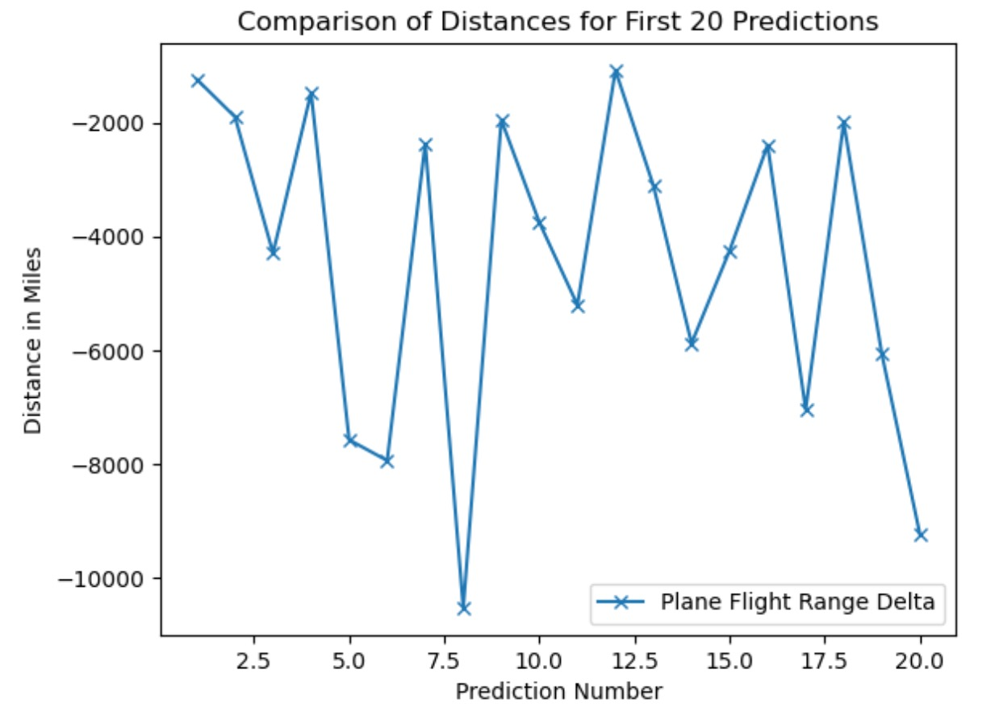
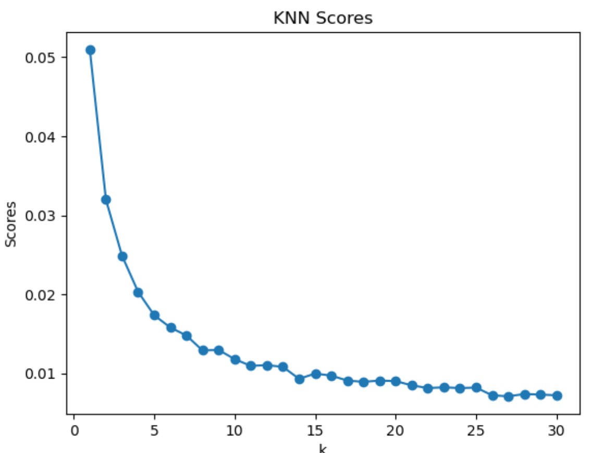
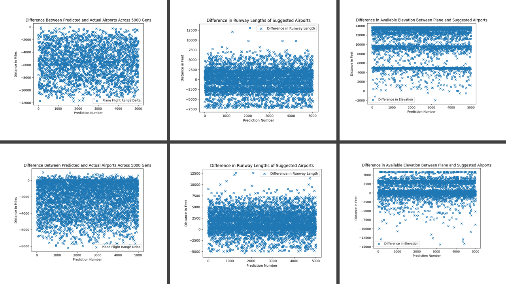
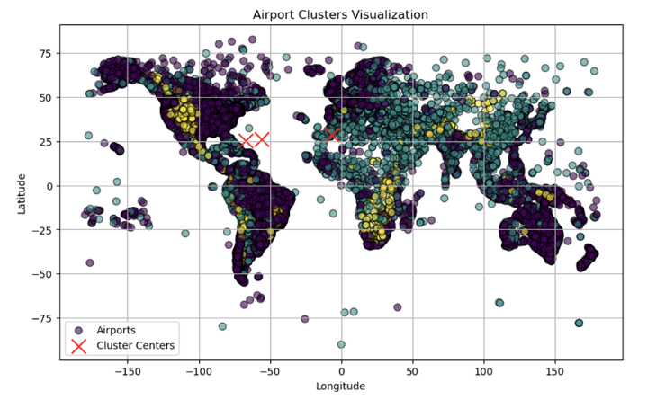

# Emergency Landing Airport Locator
### Introduction
Our project, Emergency Landing Airport Locator is going to address the issue of finding the nearest, valid airport to land at for airplanes (commercial or not) in distress to take into consideration when deciding where to emergency land. Currently, pilots use a Flight Management System (FMS) to plan their route and which airport they will land at before they take off. Then, when they approach the airport, Air Traffic Control (ATC) will direct them to the exact runway they need to land on [6]. The problem arises when, during an emergency, a pilot needs to manually reconfigure their FMS whilst under extreme stress. The goal of our project is to build a model to assist them with this part of the process.

### Datasets
We have identified two [datasets](https://github.gatech.edu/tdeshmukh8/CS4641-Group-104/tree/main/data/datasets_raw) that we have used in conjunction to build this model. The first is a list of airports, their IDs, and their locations. The second is runways by airport ID, their length, the types of aircraft that can land there, and more. By matching these two sets by Airport ID, we can build a list of runway locations to feed into our model.

### Problem Definition
The problem we are aiming to mitigate has been prevalent since the inception of the aviation industry: emergency landings. While there are several safeguards in place to assist with pilot decision-making in these situations, there have been several incidents where pilots were unable to focus due to a lack of crew resource management (CRM) and situational stress [4, 5]. For example, Pinnacle Airlines Flight 3701, where a “failure to prepare for an emergency landing promptly” resulted in a complete hull loss and death of all souls onboard [1]. Historically, similar concerns have been raised about presenting information regarding the nearest viable airport to pilots, however, the medium in which the information is presented and its accessibility (particularly concerning pilots using older systems) have been of particular interest [2, 3]. While the decision of where to land is usually qualitative, taking in a combination of situational information, information from nearby ATC, and the pilot’s intuition, providing quick access to information regarding where to land is critical for emergencies where a loss of situational awareness and judgment error is common [2, 4]. Our project provides an additional input that is easily accessible, requiring no further input than the plane’s locational data (automatically fed) and a brief pre-flight setup.

Furthermore, while automation has made flying safer, there are concerns within the field about its impacts on pilots' ability to fly a plane manually. A study comparing pilots trained with analog instruments to those trained with Electronic Flight Instrument Systems (EFIS) found that the latter group showed greater deviations in manual flying skills [7]. These results indicate that while automation can certainly aid in decision-making, it can also lead to an overall loss of manual flying skills. Here we see the need for a balance between automated assistance and manual control. By supplementing rather than replacing the skills of a pilot, our system would assist them while preventing the degradation of manual piloting skills.

### Methodology
Models: 

The initial rationale for choosing the K-Nearest Neighbors (KNN) algorithm was to utilize its spatial component for effectively modeling the real-life problem of matching an airplane to the most suitable airport. This approach considered key specification features such as the plane's current altitude, coordinates, and the minimum runway length necessary for a safe landing. Under the assumption of non-powered flight, the model aimed to match the plane to the nearest airport capable of supporting it, focusing on runway length and proximity relative to the plane’s current elevation and location. We also used cross-validation to select the best number of neighbors to use in the KNN algorithm. 

The plane's specific glide ratio, defined as the unpowered distance traveled forward over the elevation lost, was also a consideration, although it could not be incorporated directly into the main model. Instead, this feature was leveraged in our test set, which was generated using the haversine formula and glide distance estimations to identify the nearest best-suited airport. While this test set isn't fully representative of the multifaceted decision process for determining emergency landing sites, it served as a baseline for comparing our algorithm's performance against the simplest strategy of identifying the absolute nearest airport by spatial reference.

Taking into account key insights gained from the midterm report, we revised our approach to KNNs for the final report and, leveraging feature engineering, aimed to remedy some of the significant drawbacks of the original mode. In particular, the original model placed too much emphasis on matching an airplane to an airport with the same altitude and runway specification as the airplane’s minimums. In turn, this led to the generation of practically infeasible landing locations. In some cases, the airplane would be directed to another port thousands of miles away from its position purely because the matched airport more closely met the runway requirements. 

To combat this, we decided to completely redesign the data we passed into the KNN model by replacing the elevation and runway data columns with functions of the original data w.r.t. the plane the model is being trained for. For example, if we were training a model for a plane flying at 15000 ft, we would replace the elevation data for each airport with a minimizing function that approached zero for larger differences between the plane and the airport’s elevation. Passing in a plane datapoint with the elevational data set to 0, in theory, would reward maximizing the available elevation that the plane would have to navigate, providing pilots with more room for error and planning. An identical approach was taken for the runway length feature. While this would hypothetically increase the viability of our model, it also came with a significant drawback: the generalizability of the model fell significantly as it could only be used with a single plane at a single instance in time. Having said that, the training time for the model was extremely low (< 1 second), so we accepted this approach. 

In addition to KNN, we explored the potential of using a Support Vector Machine (SVM) for its effectiveness in classification tasks. SVM was considered for its ability to handle complex spatial data, which is integral to our project. However, early on, we encountered significant challenges when experimenting with SVM, particularly in terms of data separability and prolonged training times (12+ hours). The running hypothesis is that the SVM model struggled to effectively separate the feasible airports from the infeasible ones due to the overlapping nature of our dataset's features. This led to impractically long training durations, making SVM less suitable for an application that demands quick and reliable decision-making. Consequently, our focus shifted back to refining the KNN model, which showed more promise in handling the spatial complexities of emergency landings at a significantly faster pace.

First, we use the datasets to generate a map of all the possible runways a given airplane can land at:

We then generate a test set of airplane locations that we will use to evaluate our model. Here are some visualizations showing the Longitude, Latitude, and Elevation distributions of our test set.

We presumed that KMeans clustering is a good fit for this problem because it narrows down the set of potential runways based on the need of the plane. This simplifies the problem space for KNN to provide a targeted, localized solution faster and hopefully more accurately than if it was searching the entire set of runways. We used the elbow method to tune our hyperparameter of the number of clusters as shown below:
 
Based on this graph, we can settle on 3 clusters as the point past which we see diminishing returns. Thus we run our KMeans algorithm on the aforementioned Airports test set, generating this visualization:
 
After this, we fed the clusters into our modified clustered KNN and determined an optimal runway this way.

Testing:

In terms of testing, testing the models on a large ground-truth set was relatively infeasible due to the randomized nature of a plane’s location and elevation as well as a lack of included testing data with the original Kaggle files. Instead, we generated a test set of rough predictions for the best airport to land strictly based on proximity to the plane and whether an airport meets the minimum parameters for a safe landing. This utilized a very slow, computationally expensive brute-force method. 

Then, we compared the predicted outputs from our models to the generated test set, originally using basic evaluation metrics like accuracy for a foundational understanding of the matching success between the predicted and generated labels. However, the reliability of those metrics was limited as the generated labels only represented the airports closest to a plane's location. This introduced significant issues with viability, as there would be instances where a plane would be only a few feet above an airport, however since the airport was technically below and geographically closest to the plane, it would be selected in the test set. 

After discovering this, we opted to observe the distance between the plane and the predicted/actual airports as well as the differences in elevational “wiggle-room” and runway lengths. In doing this, we sought to qualitatively compare the average viability of landing safely when using airports generated by our models vs. the baseline, minimum-distance testing set. Ideally, we wanted to see more runway and elevational allowance being given in our models, which would be indicative of a model’s ability to pick a safe airport to land. Of course, the airport would also have to be within a relatively close distance of the plane.

### Results and Discussion
Analyzing the latter two visualizations, we observe the distribution of potential in-aircraft positions at varying altitudes, offering a multi-dimensional perspective crucial for emergency landing scenarios. The red dots indicate potential locations where an aircraft might need to initiate an emergency landing, with their spread across various elevations highlighting the complexities involved in the decision-making process for the kNN algorithm.

While the given accuracy score is approximately .012% with the KNN algorithm, this metric is unreliable since, as previously mentioned, the test set is simply the absolute minimum distance airports for each given plane. We also observed the change in distance between the predicted airport and the minimum distance airport to look at the feasibility of the generated airport, and we found much more revealing trends there. In general, the model produces airports that incur significant additional flight time for the plane, often at distances infeasible given the estimated range of the plane. This reveals that the model is, without any ambiguity, consistently not selecting good airports to land at. The chart below displays the difference between the flight distance from the absolute minimum distance airport and the model's predicted airport. Consistently, the number is hugely negative, which implies that the distance to the predicted airport is, in general, much larger than the distance to the minimum distance airport. While this makes sense at a surface level, the sheer magnitude of the difference suggests that the feasibility of the predicted airports is not sufficient. We also ran cross-validation and determined the optimal number of neighbors to use to be 1, as seen in the second chart below. This is likely due to most airports having only one runway, making the first closest neighbor the best. 

The main reason behind this failure is, after some investigation, theorized to be from the model's propensity to match the plane to the airport with the nearest set of features, attempting to match to not only the closest geographical airport but also the closes runway length (effectively finding the airport with a runway length closest to the plane's minimum runway length) as well as the elevation. Furthermore, since the data was normalized, each feature had equal weight in the plotting, encouraging the model to occasionally select far away airports because they had closer runway and elevation features, even when the locational features were wildly different. However, as outlined in the methodology, we were able to make substantial revisions to the original KNN algorithm above and improve upon some of these flaws. 

After revising the KNN model, we evaluated it by running it on the same test set as before and comparing three primary metrics against the original model. The first of these that we wanted to observe was the difference in range between the predicted airport and the absolute minimum distance airport (test set). A negative value for each data point represents a net increase in the plane’s necessary flight time between the predicted and actual airports, whereas a positive value indicates the opposite. In this case, we did not expect either version of the model to produce predictions closer than the absolute closest airport; however, an indicator of an improved model would be a net decrease in the necessary flight time between model iterations, or a less negative value. The second primary metric was the difference in the runway lengths between the predicted and absolute minimum airports, wherein a negative value represents a greater length for the predicted airport and a positive value represents a greater length for the baseline. Because the original KNN model tried to match the runways closely to the minimum, we are looking for a greater difference between the runway lengths (in the predicted airport’s favor) as an indicator of improvement for our model. Finally, the third metric we were looking at was the difference in the elevational differences between the actual airport and the plane and the predicted airport and the plane. In this case, having a negative value meant that the predicted airport afforded more elevation (“wiggle-room”) for the pilots to use vs. the actual airport; again, a positive value indicated the opposite. In a similar fashion to the runway metric, a successful model would have a consistently negative value. 

Below is a set of charts representing each of these metrics across 5000 sample planes. From left to right, the charts display the first, second, and then third metrics. Finally, the top row of charts uses data from the original KNN model, whereas the bottom row uses data from the updated KNN model. 

From the charts, it can be observed that by and large, the updated model performed significantly better than the original implementation, predicting airports that are not only closer in proximity to the planes but also, on average, providing much more elevational room for the pilots to use when conducting an emergency landing. Specifically, the average difference in flight time between the iterations was about -5550 for the old model and -2200 for the new model, showing significant improvement. Averages for the difference in the elevational room followed similarly, an astounding 11107 vs 667 feet. However, the difference in the runway length worked against the new version of the model, showing averages of -226 vs 1570, showing that the new model performs significantly worse in terms of providing extra runway. 

Initially, KMeans was considered to categorize runways based on their characteristics such as length, elevation, and geographical location. Using the elbow method, we determined that the optimal number of clusters for our dataset was three. However, when we restricted the K-Nearest Neighbors (KNN) algorithm to operate within these KMeans-defined clusters, we observed anomalies in accurately matching airplane positions to appropriate airports.

A key finding in our study was the importance of feature scaling, especially concerning the longitude and latitude values. By assigning greater weight to these geographical features, we aimed to enhance the precision of our model. Despite this effort, the integration of KMeans with KNN did not yield the desired improvement in accuracy. The combined approach was found to be less effective than utilizing a KNN model with well-engineered features alone.

Our analysis suggests that the homogeneity of the runway data, coupled with potentially irrelevant clustering features, may have limited the effectiveness of the KMeans algorithm in this context. Additionally, the linear nature of the KMeans clustering might have been insufficient to capture the more complex, non-linear relationships inherent in our dataset. Consequently, we concluded that a standalone KNN model, empowered by carefully engineered features and appropriate feature scaling, particularly for longitude and latitude, was more adept at accurately determining optimal runway choices for various airplane types and locations. This approach aligns with our understanding that KNN's strength lies in its ability to make localized decisions based on the proximity and similarity of data points, making it particularly suitable for our application.

### Conclusion

Overall, this exploration into the viability of using machine learning to help decide landing locations proved extremely insightful and highlighted a multitude of benefits and drawbacks that the use of ML in the decision-making process can bring. In particular, while our original models were able to predict a viable location for landing, there were many instances where the model would suggest something entirely infeasible, potentially confusing pilots should they use it. Much of this inaccuracy came from our original, incorrect application of KNNs as well as some issues in the testing set since some test planes had no viable airports at all given they were in the middle of the ocean. Furthermore, while the exploration into separating the collection of airports into regions of viability for a plane using K-Means did reduce the numerical input under certain clustering numbers, the accuracy of the model’s predictions thereafter only suffered. Additionally, though perhaps able to be engineered in the future, SVMs also proved a dead-end for us as they introduced a significant amount of computational complexity to our system and, to our knowledge, were unable to be trained properly on our dataset. 

Having said these things, our project also shed some light on the potential benefits of using machine learning as an assistant to the decision-making process for pilots, instead of a complete replacement for traditional charting. Our improved KNN model consistently provided more elevational room for pilots to navigate in the event of an emergency, something which was not accounted for by simply finding the closest airport. After some more tweaking, it is entirely possible that this model could serve as a supplementary source of information for pilots to use. Furthermore, because of the already fast speed of training, further tweaks to our model and better integration with K-Means could result in lightning-fast predictions. Additionally, the ability to easily integrate more features into KNNs, coupled with its speed, could even give pilots the option to pass in certain parameters into the model, ignoring others they deem irrelevant and allowing for a high degree of customizability. While these are all theoretical, we believe our work here serves as a basis for these ideas and proves, in limited scope, their potential viability. 

### Video Link

https://youtu.be/Vlm-KhlXsZE

### References
[1] Crash of Pinnacle Airlines Flight 3701, https://www.ntsb.gov/investigations/accidentreports/reports/aar0701.pdf (accessed Oct. 6, 2023). 

[2] K. W. Williams, GPS Design Considerations: Displaying Nearest Airport Information, https://libraryonline.erau.edu/online-full-text/faa-aviation-medicine-reports/AM98-12.pdf (accessed Oct. 6, 2023). 

[3] G1000 Integrated Flight Deck Pilot’s Guide, https://static.garmin.com/pumac/190-00498-08_0A_Web.pdf (accessed Oct. 6, 2023). 

[4] D. P. Broome, Accident Reduction through Crew Resource Management , https://core.ac.uk/download/pdf/217175483.pdf (accessed Oct. 6, 2023). 

[5] J. C. Price and J. S. Forrest, “Airport emergency planning, PART II: Emergency management functions,” Practical Airport Operations, Safety, and Emergency Management, https://www.ncbi.nlm.nih.gov/pmc/articles/PMC7170197/ (accessed Oct. 6, 2023). 

[6] R. James, “Finding the right runway: How do pilots know where to land?,” Pilot Teacher, https://pilotteacher.com/finding-the-right-runway-how-do-pilots-know-where-to-land/ (accessed Nov. 8, 2023).

[7] “Automation - aeronautical decision making,” Flight Study, https://www.flight-study.com/2021/01/automation-aeronautical-decision-making.html (accessed Nov. 8, 2023). 

### Midterm Contribution Table

| Task                                       | Contributors            |
|--------------------------------------------|-------------------------|
| Data Sourcing and Cleaning/Model Selection | All                     |
| Data Preprocessing                         | Erik                    |
| Model Coding                               | Abhi, Minhyuk, and Erik |
| Result Evaluations and Analysis            | Erik                    |
| Midterm Report                             | Adam and Tanay          |

### Final Contribution Table

| Task                                       | Contributors            |
|--------------------------------------------|-------------------------|
| SVM Model | Erik, Abhi, and Minhyuk                    |
| KMeans Model | Tanay and Adam                   |
| Presentation            | Abhi                   |
| Final Report                             | Minhyuk and Tanay          |

### Timeline
https://docs.google.com/spreadsheets/d/1gBXDM0PauWLqYyAih0qr2-lfW5k0IxX34-tFH5NpNmw/edit?usp=sharing

